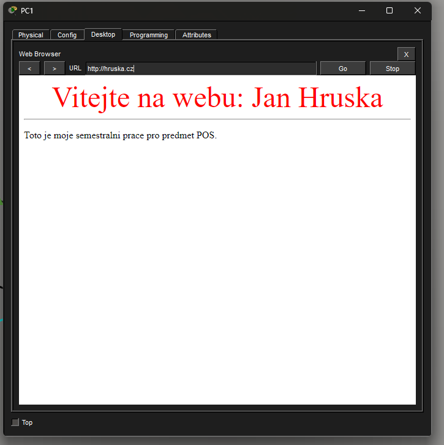
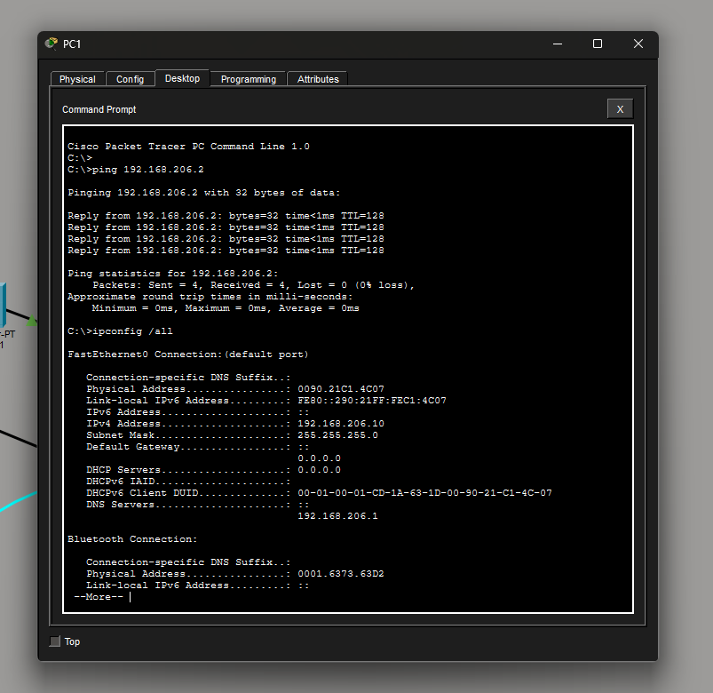
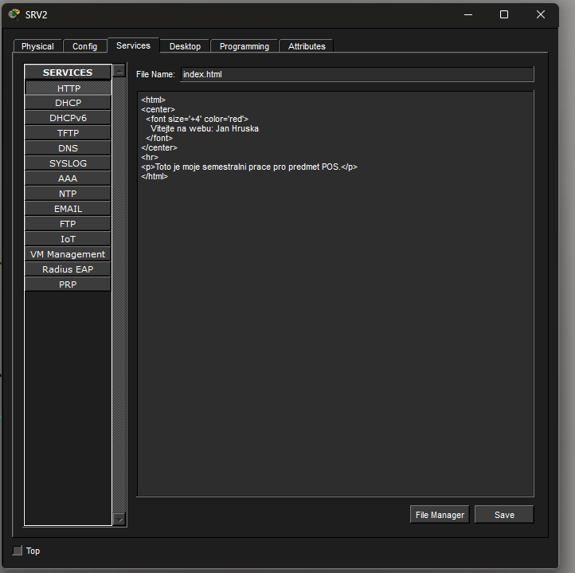
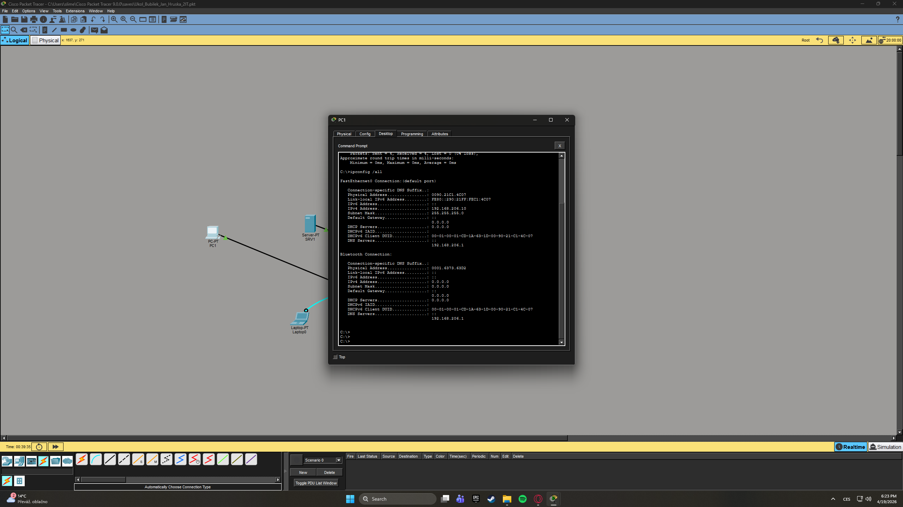
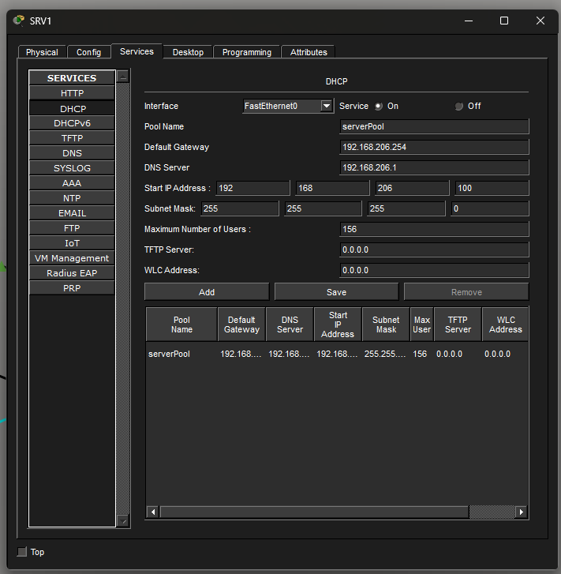
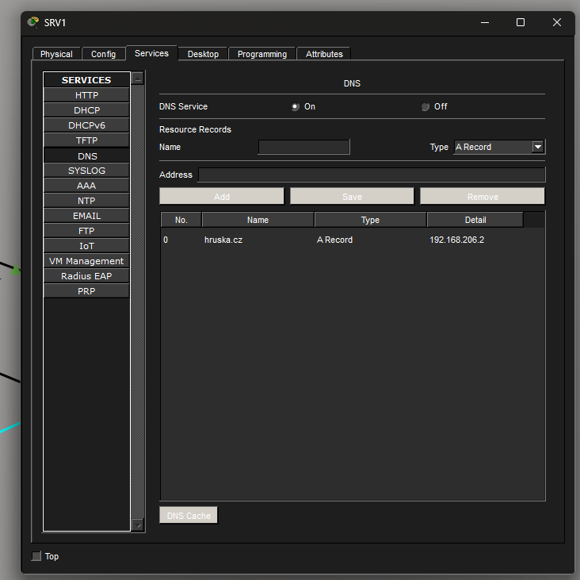

# Projekt LAN.PKT - Jan Hruška

## Výpočet X
- Příjmení: HRUSKA
- Výpočet: H(72)+R(82)+U(85)+S(83)+K(75)+A(65) = 462
- Modulo: 462 mod 256 = **206**
- Přiřazený rozsah: **192.168.206.0 / 24**

## Popis sítě
Síť se skládá ze dvou switchů (S1, S2). Na S1 jsou připojena klientská PC, na S2 jsou servery.
- **SRV1:** Poskytuje DHCP (pro PC2) a DNS (pro doménu hruska.cz).
- **SRV2:** Hostuje webovou stránku se jménem.
- **Konfigurace:** Switche byly konfigurovány přes terminál z Laptopu.

## Snímky obrazovky z Cisco Packet Tracer

### 1. Webová stránka z PC1 (hruska.cz)

### 2. PC1 - ipconfig a test pingu na doménu

### 3. PC2 - potvrzení získání adresy z DHCP

### 4. Nastavení DHCP služby na SRV1

### 5. Nastavení DNS záznamu na SRV1

### 6. HTML kód webové stránky na SRV2

